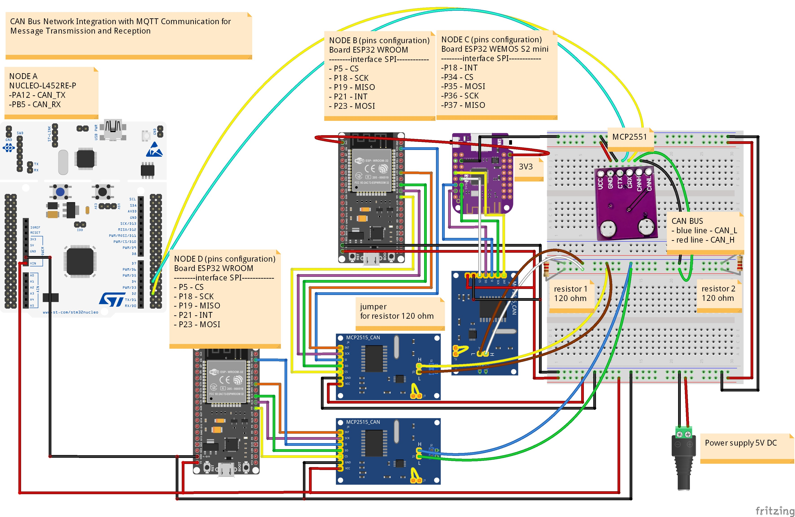
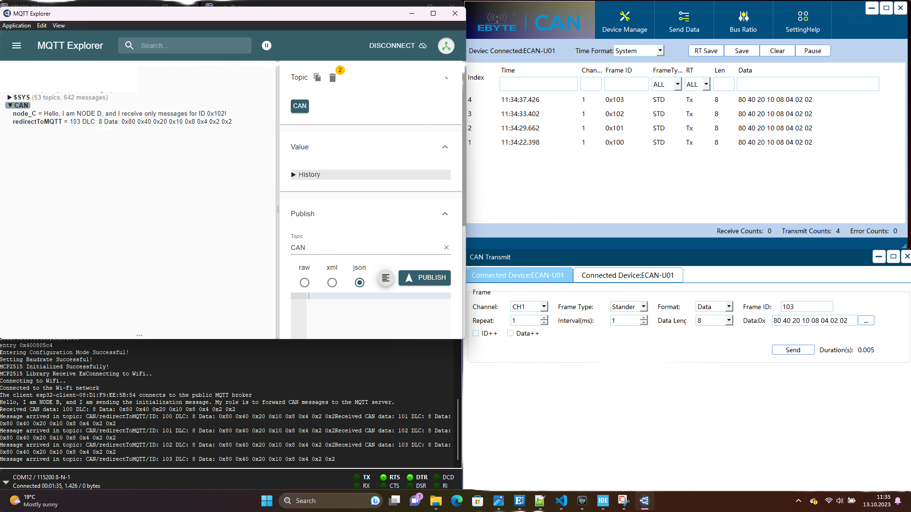
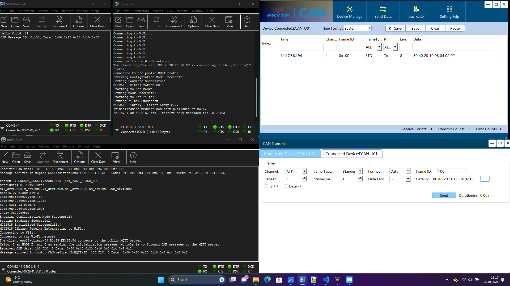
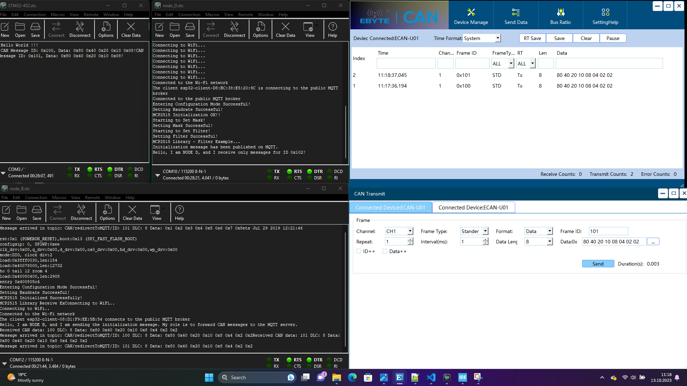
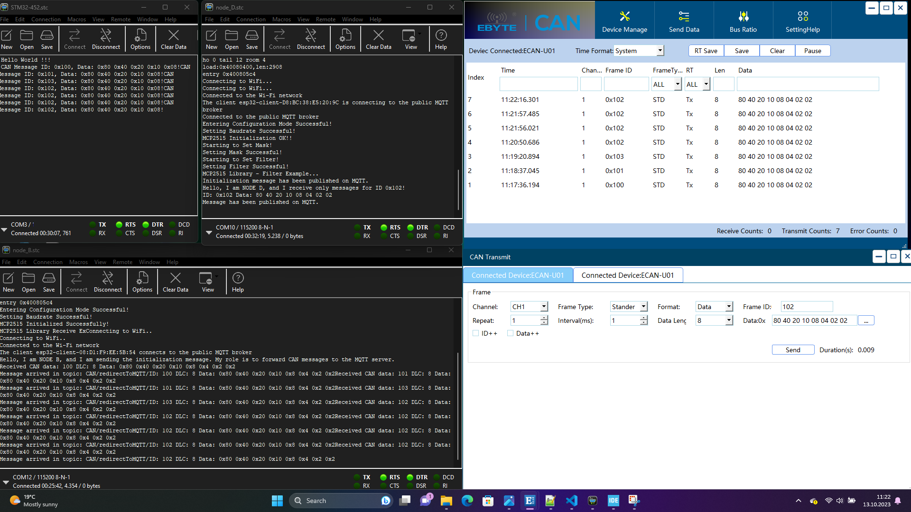

# CAN Bus Network with MQTT Integration 🚗🏭

## Overview

This project aims to establish a robust Controller Area Network (CAN) bus network using four CAN nodes. It incorporates three MCP2515 modules connected to ESP32 microcontrollers and an additional MCP2551 transceiver for an STM32L452 microcontroller. The primary goal of this project is to create a reliable communication system for transmitting and receiving messages over the CAN bus. This CAN network serves as a crucial link for seamless data exchange among the connected devices, making it suitable for various applications, including automotive, industrial automation, and more.

In addition to CAN bus communication, this project also integrates an MQTT server for forwarding the messages, enhancing data accessibility and integration.

## Features

- CAN bus communication among four nodes.
- Integration of MCP2515 modules with ESP32 microcontrollers.
- Use of MCP2551 transceiver with an STM32L452 microcontroller.
- Reliable data exchange for automotive, industrial, and other applications.
- Integration with an MQTT server for message forwarding.
- Open-source and customizable for your specific requirements.

## Getting Started

To set up this project, follow these steps:

1. **Hardware Setup:** Connect the MCP2515 modules to ESP32 microcontrollers and the MCP2551 transceiver to the STM32L452 microcontroller.

2. **Software Configuration:** Configure the software for each microcontroller node, ensuring proper CAN message handling.

3. **Compile and Flash:** Compile the code for each microcontroller and flash it onto the devices.

4. **Start Communication:** Once the nodes are powered up, they should establish communication over the CAN bus.

5. **MQTT Integration:** Configure and start the MQTT server for message forwarding.

## Usage

You can use this project as a foundation for various applications, including but not limited to:

- Automotive vehicle networks.
- Industrial automation systems.
- IoT and sensor data collection networks.
- Data integration and forwarding via MQTT.

Feel free to customize and expand upon this project to suit your specific needs.

## Contributors

- [Dan](https://github.com/aureliosss) - Project Lead

## License

This project is licensed under the [MIT License](LICENSE) - see the [LICENSE](LICENSE) file for details.
